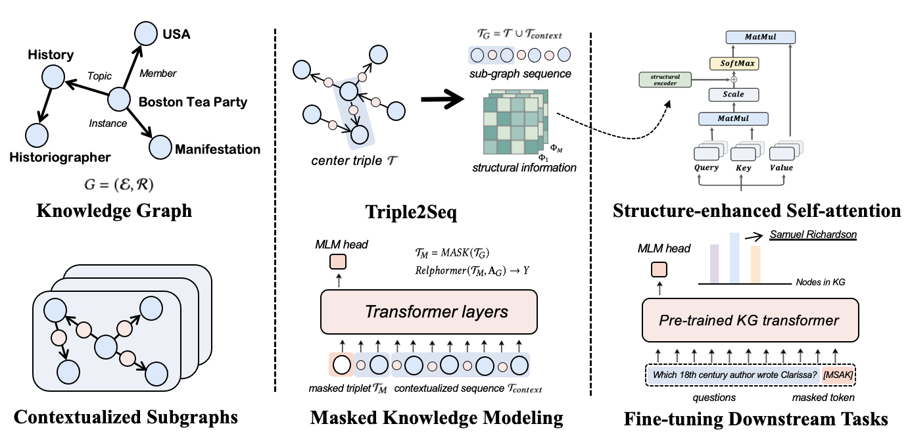

# Relphormer

Code for the Neurocomputing 2023 paper: "[Relphormer: Relational Graph Transformer for Knowledge Graph Representations](https://arxiv.org/abs/2205.10852)".


> Transformers have achieved remarkable performance in widespread fields, including natural language processing, computer vision and graph mining. However, vanilla Transformer architectures have not yielded promising improvements in the Knowledge Graph (KG) representations, where the translational distance paradigm dominates this area. Note that vanilla Transformer architectures struggle to capture the intrinsically heterogeneous semantic and structural information of knowledge graphs. To this end, we propose a new variant of Transformer for knowledge graph representations dubbed Relphormer. Specifically, we introduce Triple2Seq which can dynamically sample contextualized sub-graph sequences as the input to alleviate the heterogeneity issue. We propose a novel structure-enhanced self-attention mechanism to encode the relational information and keep the globally semantic information among sub-graphs. Moreover, we propose masked knowledge modeling as a new paradigm for knowledge graph representation learning. We apply Relphormer to three tasks, namely, knowledge graph completion, KG-based question answering and KG-based recommendation for evaluation. Experimental results show that Relphormer can obtain better performance on benchmark datasets compared with baselines.


# Model Architecture

<div align=center>

</div>
 

The model architecture of Relphormer. 
The contextualized sub-graph is sampled with Triple2Seq, and then it will be converted into sequences while maintaining its sub-graph structure.
Next, we conduct masked knowledge modeling, which randomly masks the nodes in the center triple in the contextualized sub-graph sequences.
For the transformer architecture, we design a novel structure-enhanced mechanism to preserve the structure feature.
Finally, we utilize our pre-trained KG transformer for KG-based downstream tasks. 

# Environments

- python (3.8.18)
- Ubuntu-18.04.6 (4.15.0-156-generic)

# Requirements

To run the codes, you need to install the requirements:
```
pip install -r requirements.txt
```

The expected structure of files is:

```
 ── Relphormer
    ├── data
    ├── dataset
    │   ├── fb15k-237
    │   ├── wn18rr
    │   ├── umls
    │   ├── create_neighbor.py
    ├── lit_models
    │   ├── _init_.py
    │   ├── base.py
    │   ├── transformer.py
    │   └── utils.py
    ├── models
    │   ├── _init_.py
    │   ├── huggingface_relformer.py
    │   ├── model.py
    │   └── utils.py    
    ├── resource
    │   └── model.png    
    ├── scripts
    │   ├── fb15k-237
    │   └── wn18rr
    ├── QA
    ├── main.py
    └── requirements.txt
```

# How to run

## KGC Task

###  Pre-trained Model Preparation 

- First download the pre-trained model.
```shell
>> cd Relphormer
>> mkdir -p Pre-trained_models/bert-base-uncased
>> cd Pre-trained_models/bert-base-uncased
```
To download the pre-training model, run the following commands.
```
wget https://hf-mirror.com/bert-base-uncased/resolve/main/config.json
wget https://hf-mirror.com/bert-base-uncased/resolve/main/pytorch_model.bin
wget https://hf-mirror.com/bert-base-uncased/resolve/main/tokenizer.json
wget https://hf-mirror.com/bert-base-uncased/resolve/main/tokenizer_config.json
wget https://hf-mirror.com/bert-base-uncased/resolve/main/vocab.txt
```

### Entity Embedding Initialization

- Then use the command below to add entities to BERT and initialize the entity embedding layer to be used in the later training. For other datasets `fb15k-237`  and `wn18rr` ,  just replace the dataset name with `fb15k-237` and  `wn18rr` will be fine.

```shell
>> cd Relphormer/
>> bash scripts/fb15k-237/pretrain_fb15k.sh
```

The pretrained models are saved in the `Relphormer/pretrain/output` directory.

For convenience, we provide users with our processed masked files and **pre-trained checkpoints**, you can download from [here](https://drive.google.com/drive/folders/1siVVMNJYdYWcFby3PhEZv-UiLxbOYHnx?usp=share_link).

### Entity Prediction

- Next use the command below to train the model to predict the correct entity in the masked position. Same as above for other datasets.


```shell
>> cd Relphormer
>> python dataset/create_neighbor.py --dataset "fb15k-237"
>> bash scripts/fb15k-237/fb15k.sh
```

The trained models are saved in the `Relphormer/output` directory.


## QA Task
The experimental settings in QA follow the [Hitter](https://arxiv.org/pdf/2008.12813.pdf) experimental settings, and the environment installation can be done by referring to [GitHub](https://github.com/microsoft/HittER). We only modified **hitter-best.py** to fit our model.

- The relphormer model used by QA can be downloaded [here](https://drive.google.com/file/d/1FK_A_kFq1ECoNm75RfkcvYv8rZiJL1Bw/view?usp=sharing).

```shell
>> cd QA
>> sh scripts/relphormer_fbqa.sh
>> sh scripts/relphormer_fbqa_filtered.sh 
>> sh scripts/relphormer_webqsp.sh
>> sh scripts/relphormer_webqsp_filtered.sh
```

# Citation
If you use the code, please cite the following paper:

```bibtex
@article{BI2023127044,
title = {Relphormer: Relational Graph Transformer for knowledge graph representations},
journal = {Neurocomputing},
pages = {127044},
year = {2023},
issn = {0925-2312},
author = {Zhen Bi and Siyuan Cheng and Jing Chen and Xiaozhuan Liang and Feiyu Xiong and Ningyu Zhang},
}
```
